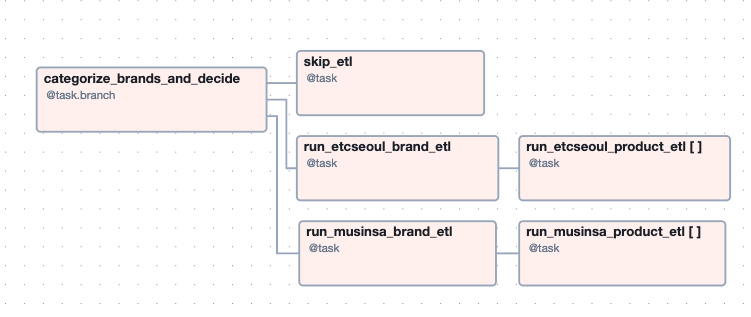

# PPicker Airflow ETL

모듈화된 Docker 기반 Airflow ETL 파이프라인으로, 패션 플랫폼의 브랜드 및 상품 데이터를 추출하고 처리합니다.

## 프로젝트 구조

```
.
├── dags
│   └── simplified_brand_etl.py
├── etl
│   ├── musinsa
│   │   ├── brand_etl.py
│   │   └── product_etl.py
│   └── etcseoul
│       ├── brand_etl.py
│       └── product_etl.py
├── Dockerfile
├── docker-compose.yml
├── requirements.txt
└── .gitignore
```

## DAGs

### `dags/simplified_brand_etl.py`
- 매일 오전 1시에 실행되는 `simplified_brand_etl` DAG 정의  
- 브랜드 URL을 Musinsa/ETC서울로 분류하는 브랜치 태스크 (`@task.branch`)  
- 플랫폼별 브랜드 ETL 병렬 실행 태스크 (`run_musinsa_brand_etl`, `run_etcseoul_brand_etl`)  
- `.expand()`를 사용한 per-브랜드 상품 ETL 병렬화 (`run_*_product_etl`)  
- 최종 `skip_etl` 태스크: 어떤 ETL도 실행되지 않을 경우 깨끗한 종료 보장  

## ETL 모듈

`etl/` 디렉토리 하위에 ETL 로직이 모여 있습니다:

### `etl/musinsa/`
- `brand_etl.py`  
  Musinsa에서 브랜드 메타데이터를 스크래핑 및 정규화합니다.  
- `product_etl.py`  
  브랜드별 상품 목록을 가져와 변환 후 저장소에 적재합니다.  

### `etl/etcseoul/`
- `brand_etl.py`  
  ETC서울 브랜드 ETL 로직.  
- `product_etl.py`  
  ETC서울 상품 ETL 로직.  


### DAG 구조



## 인프라

- **Dockerfile**  
  ETL 코드가 포함된 Python 기반 Airflow 이미지를 빌드합니다.  
- **docker-compose.yml**  
  Airflow(스케줄러, 웹서버, 워커) 및 PostgreSQL 서비스 구성  
- **requirements.txt**  
  Airflow, pgvector, AWS SDK 등 의존성 목록  


## 주요 설계 포인트

- **브랜칭 & 팬아웃**  
  Airflow TaskFlow API (`@task.branch`, `.expand()`) 활용으로 명확하고 확장 가능한 워크플로우  
- **플랫폼 무관 ETL**  
  공통 헬퍼 및 일관된 클래스 인터페이스로 신규 플랫폼 추가 용이  
- **컨테이너화된 배포**  
  로컬 개발, CI, 프로덕션 환경 간 일관성 유지  


